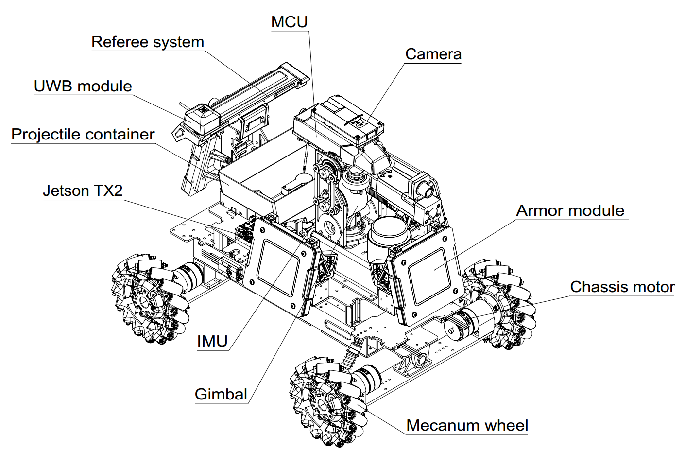

## Hardware Setup

The following shows an example robot designed by RoboMaster.

We recommended the following hardware to assemble robot:

| Product Name                             | Quantity |
| ---------------------------------------- | -------- |
| Nvidia Jetson TX2                        | 1        |
| Lidar                                    | 1        |
| Camera                                   | 1        |
| RoboMaster M3508 P19 Brushless DC Gear Motor | 4        |
| RoboMaster C620 Brushless Gear Motor Governor | 4        |
| RoboMaster EC60 Brushless Gear Motor     | 4        |
| RoboMaster RoboMaster ESC Center board   | 1        |
| RoboMaster EC60 Brushless Gear Motor-01  | 1        |
| RoboMaster EC60 Brushless Gear Motor-02  | 1        |
| RoboMaster EC60 Brushless Gear Motor-03  | 1        |
| RoboMaster EC60 Brushless Gear Motor-04  | 1        |
| RoboMaster Mecanum Wheels (left)         | 2        |
| RoboMaster Mecanum Wheels (right)        | 2        |
| RoboMaster 6623 Servo  Motor (with ESC)  | 2        |
| DJI Snail 2305 motor                     | 2        |
| DJI Snail 430-R ESC                      | 2        |
| RoboMaster M2006 P36 Brushless DC Gear Motor | 1        |
| RoboMaster C610 Brushless Gear Motor Governor | 1        |
| RoboMaster Red Laser Sight               | 1        |
| RoboMaster TB47D Battery                 | 1        |
| RoboMaster Battery Rack（compatible with TB47D） | 1        |
| RoboMaster Robot Remote Controller       | 1        |
| RoboMaster Master Control Board of Robot | 1        |
| RoboMaster New Generation Master Control Board of Robot | 1        |
| RoboMaster TB47 AC Cable of 100W Charger | 1        |
| RoboMaster TB47 Battery Charger 100W     | 1        |

(TODO)