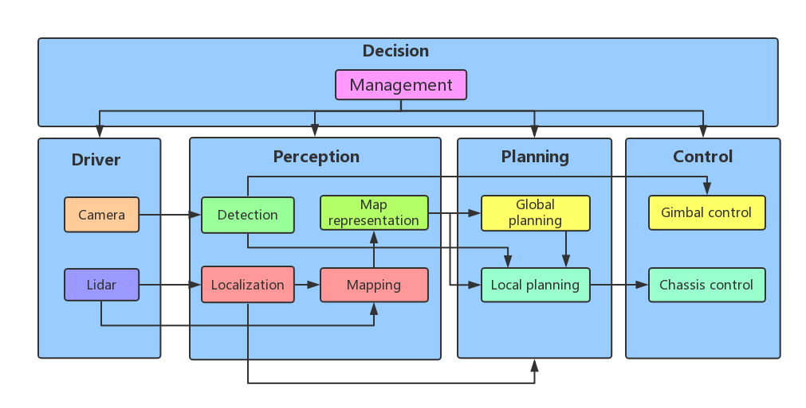

# Software Architecture

## Overview

The autonomous mobile robot system consists of driver, perception, planning, control and decision modules, where the control module is deployed in the micro-controller unit (MCU), others are deployed in the on-board computer and can be individually controlled by the management.

(TODO)